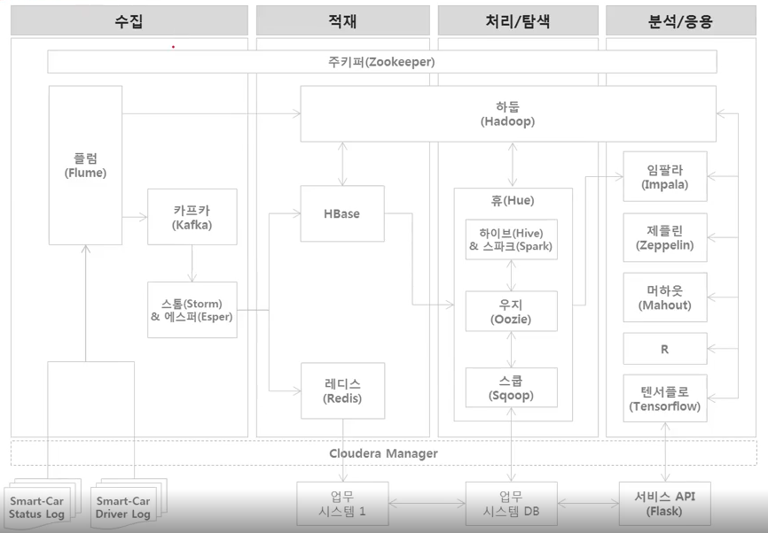
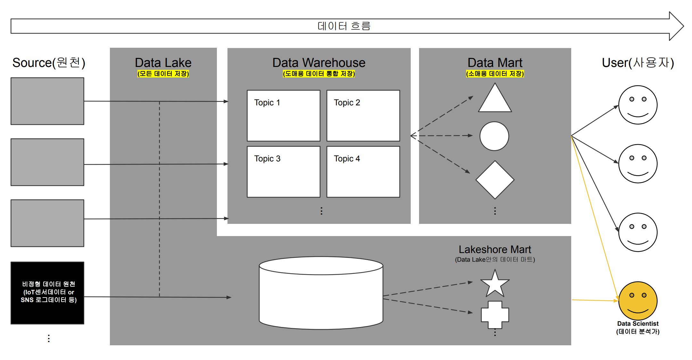

# Big data example

[스마트카 빅데이터를 이용한 파일럿 프로젝트](https://www.inflearn.com/course/%EB%B9%85%EB%8D%B0%EC%9D%B4%ED%84%B0-%ED%8C%8C%EC%9D%BC%EB%9F%BF-%ED%94%84%EB%A1%9C%EC%A0%9D%ED%8A%B8)

[실무로 배우는 빅데이터 기술](http://aladin.kr/p/7NN12)

# Architecture

# [빅데이터 이해](doc/1-understanding_bigdata)

---

## Appendix

### Big data

빅데이터의 정의 6V

- 크기(Volume): 방대한 양의 데이터(테라, 페타바이트 이상의 크기)
- 다양성(Varity): 정형(DBMS, 전문 등) + 비정형(SNS, 동영상, 사진, 음성, 텍스트 등)
- 속도(Velocity): 실시간으로 생산되며, 빠른 속도로 데이터를 처리/분석

\+

- 진실성(Veracity): 주요 의사결정을 위해 데이터의 품질과 신뢰성 확보 
- 시각화(Visualization): 복잡한 대규모 데이터를 시각적으로 표현

=

- 가치(Value): 비즈니스 효익을 실현하기 위해 궁극적인 가치를 창출

방대한 크기(Volume)의 다양한(Varity) 데이터들이 빠른 속도(Velocity)로 발생하고 있다.  
빅데이터는 3V를 수용하며, 데이터의 진실성(Veracity)을 확보하고, 분석 데이터를 시각화(Visualization)함으로써 새로운 효익을 가져다 줄 가치(Value)를 창출하는 것이다

### 선행연구 (Pilot study)

POC (Proof of Concept)
- 프로젝트에 사용되는 기술과 아키텍쳐에 대한 컨셉 증명
POV (Proof of Value)
- 비즈니스적인 효익에 대한 가치 증명
BMT (BenchMark Test)
- 대규모 인프라에 대한 성능과 가용성 테스트

### [Database](https://ehyun0128.github.io/miscellaneous/dm_dw_dl/)

Data Mart
- Data Mart(이하 DM)은 현업에서 데이터를 활용하는 담당자가 데이터를 활용하기 위한 형태 거의 그대로 데이터를 쌓아두는 공간이다.
- 각 현업에서 사용하는 업무단위 처럼 상세한 단위로 데이터를 저장하고, 사용한다.
- DM은 현업 담당자(소비자)가 필요한 데이터(상품)을 직접 골라담아 소비할 수 있는 공간(소매점, 마트)이라고 할 수 있다.

Data Warehouse
- Data Warehouse(이하 DW)는 데이터 소매점(DM)에 공급하게될 데이터를 다양한 원천에서 수집하여 주제별로 저장하는 데이터 도매점과 같은 공간이다.
- 즉 다양한 원천에서 발생하는 데이터를 소비자에게 전달하기 전에 통합하여 저장하는 공간이라고 할 수 있다.
- 그런데 다양한 원천에서 발생하는 데이터는 발생 지점의 환경에 따라 서로 다른 구조(스키마)나 데이터에 사용된 용어(동음이의어/이음동의어)등의 문제가 야기된다.
- DW는 이러한 문제들을 전사적 관점에서 고려하여 다양한 데이터를 통합저장하는 구조로 설계되고 구축된다.
- 단, DW 스타일에서는 통합되는 과정에서 데이터를 정제하는 비용과 버려지는 데이터가 발생한다. 이러한 점이 Data Lake의 등장이 야기되는 지점이다.

Data Lake
- Data Lake(이하 DL)은 다양한 원천을 하나의 통합된 형태로 정제한 DW와 달리, 다양한 원천을 그대로 가져와 저장하여 다양성을 보존하는 스타일을 가지고 있다.
  - 즉, DL은 원천에서 발생한 데이터를 다양한 형태 그대로 한 곳에 저장하는 공간이라고 할 수 있다.
- DL은 크게 3가지 가 맞물려서 등장한 것으로 생각한다.
  - Data Science 붐에 따른 기존과 차별화된 분석 니즈(한 가지 관점으로 통합된 DW 대신 다양한 가정을 추론할 수 있도록 설계된 구조가 요구됨)
  - IoT 센서데이터와 SNS(소셜 네트워크 서비스)등에서 발생하는 비정형 데이터의 범람
  - Hadoop 분산형 저장구조를 통한 대용량 데이터의 저비용(효율적) 저장 기술 도래
